# 🎨 Aura

<div align="center">
  
  
  
  
</div>

<p align="center">
  <strong>A beautiful wallpaper & video discovery app built with Kotlin Multiplatform</strong>
</p>

<p align="center">
  Browse and download stunning wallpapers and videos from Pexels with native experiences on Android and iOS
</p>

---

## ✨ Features

- 🖼️ **Curated Wallpapers** - Browse trending and hand-picked wallpapers
- 🎥 **Video Support** - Browse, search, and download high-quality videos (Android & iOS)
- 🔍 **Smart Search** - Find wallpapers and videos by keyword with instant results
- 📥 **Download Support** - Save wallpapers and videos directly to your device
- ♾️ **Infinite Scroll** - Seamless pagination for endless browsing
- 🎯 **State Preservation** - Smart navigation between curated and search modes
- 🌓 **Native UI** - Jetpack Compose for Android, SwiftUI for iOS
- 🚀 **MVI Architecture** - Predictable state management
- 📱 **Edge-to-Edge** - Immersive full-screen experience

## 📱 Screenshots
|                     Android                     |                     iOS                     |
|:-----------------------------------------------:|:-------------------------------------------:|
| 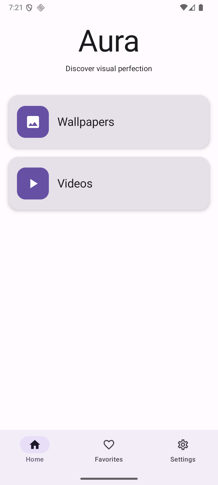 | 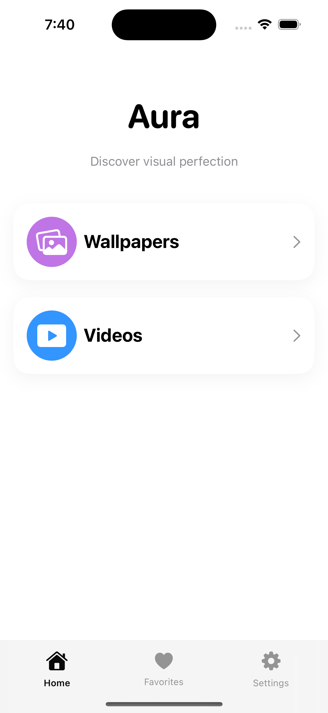 |
| 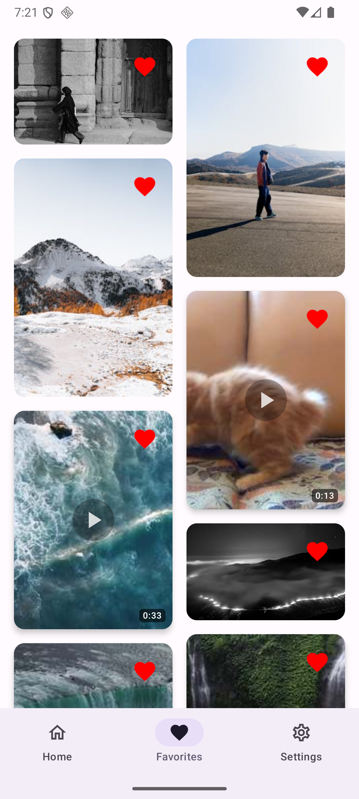 | 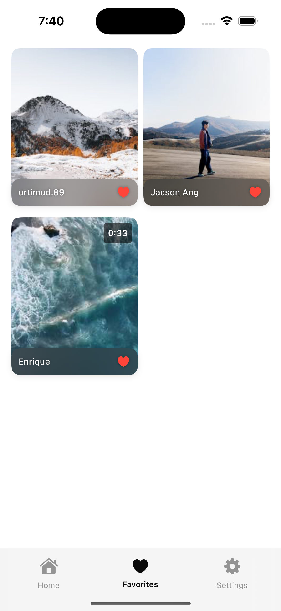 |
|  | 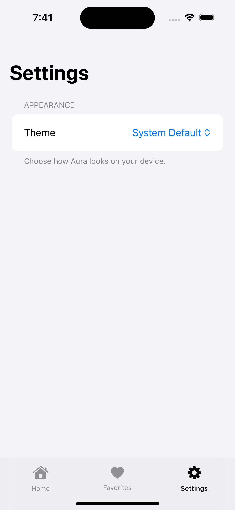 |
| 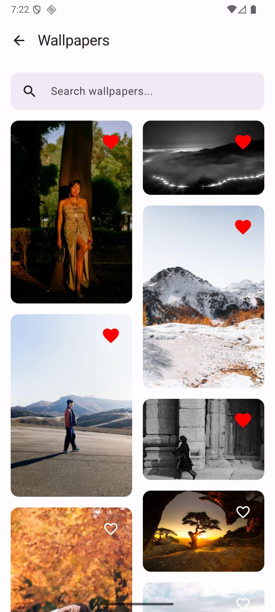 |  |
|  | 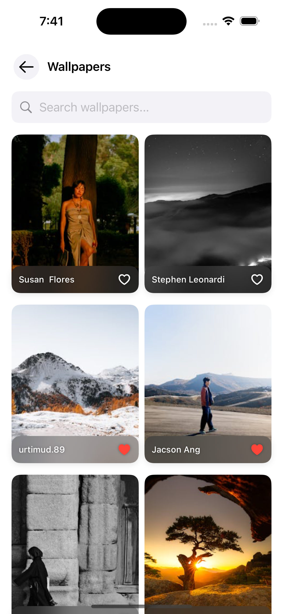 |
| 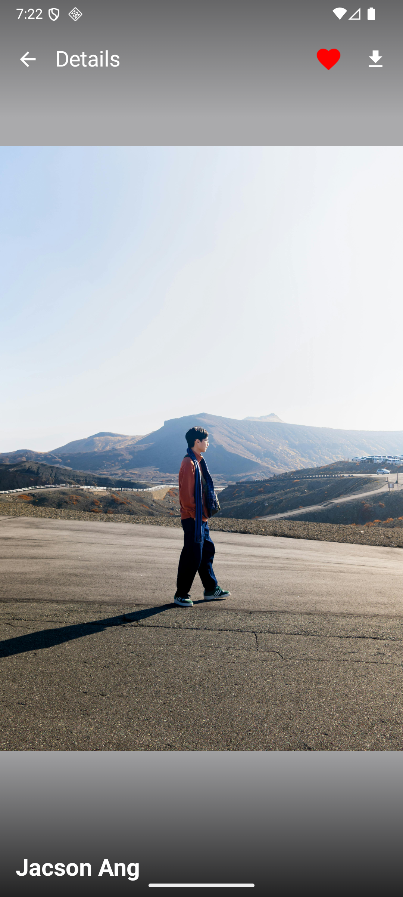 | 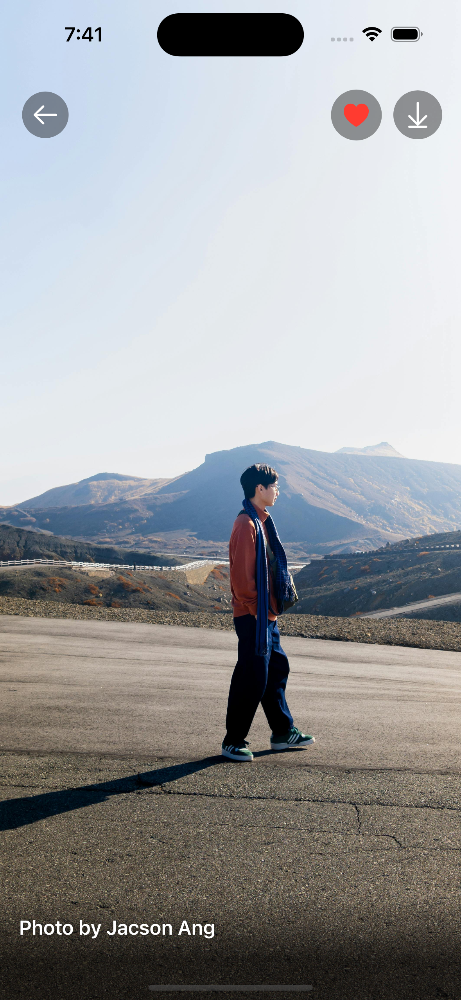 |
| 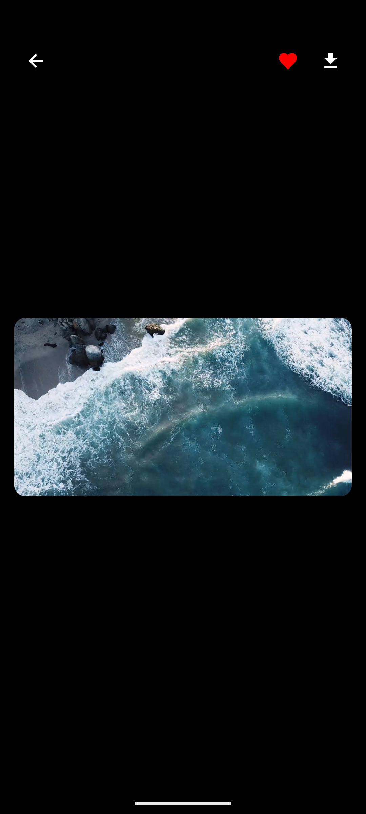 | 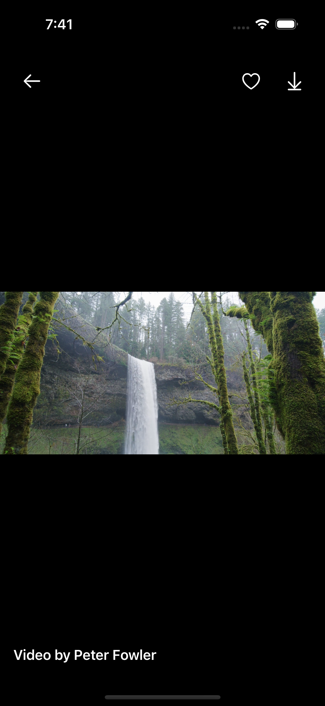 |

Tablet 
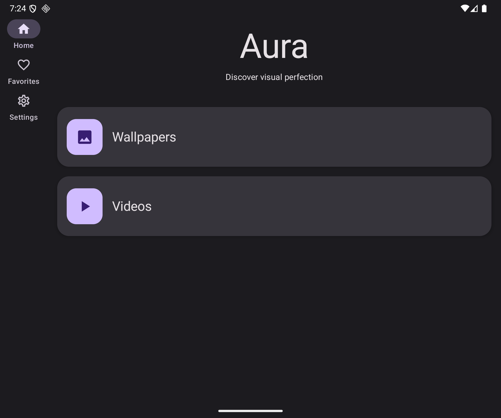 
 
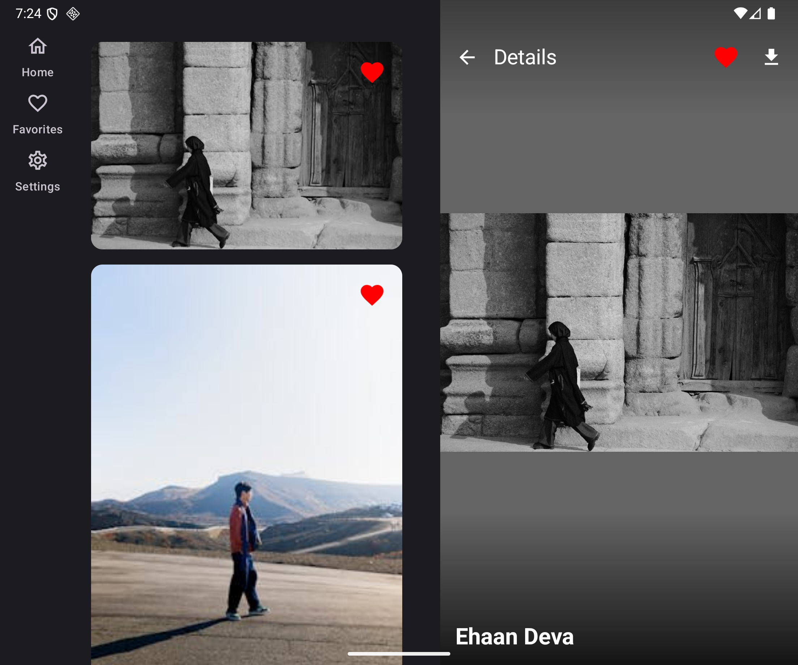 
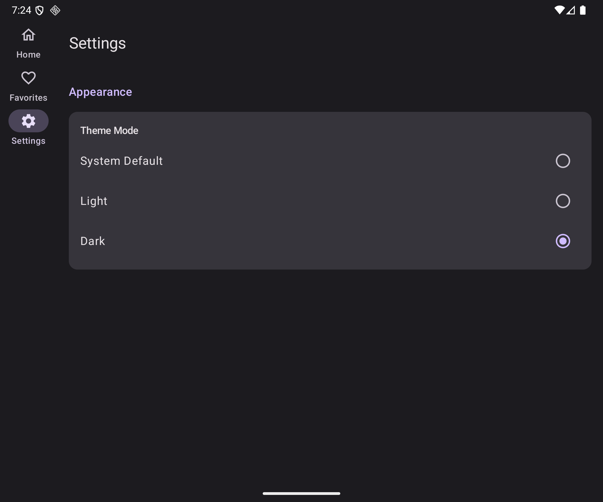 

## 🏗️ Architecture

Aura follows **Clean Architecture** principles with an **MVI (Model-View-Intent)** pattern, leveraging Kotlin Multiplatform to share business logic across platforms while maintaining native UI experiences.

### Project Structure
```text
Aura/
├── shared/ # Shared Kotlin Module (Business Logic)
│ ├── commonMain/.. # Platform-agnostic code
│ │ ├── data/ # Data layer (API, DTOs, Repository impl)
│ │ ├── domain/ # Domain layer (Models, Repository interface)
│ │ └── di/ # Dependency injection (Koin)
│ ├── androidMain/ # Android-specific implementations
│ └── iosMain/ # iOS-specific implementations
│
├── app/ # Android Application
│ ├── feature/ # Feature modules (home, detail, videos)
│ ├── shared/ # Shared Android components
│ ├── di/ # Android DI modules
│ ├── MainActivity.kt
│ └── MainApplication.kt
│
└── iosApp/ # iOS Application
├── feature/ # Feature modules (home, detail, videos)
├── core/ # Core iOS utilities
├── iOSApp.swift # App entry point
└── Info.plist
```


### Architecture Layers
```text
┌─────────────────────────────────────────────────────┐
│                  Presentation Layer                 │
│ ┌─────────────────────┐ ┌─────────────────────┐     │
│ │  Jetpack Compose    │ │       SwiftUI       │     │
│ │     (Android)       │ │         (iOS)       │     │
│ └─────────────────────┘ └─────────────────────┘     │
└─────────────────────────────────────────────────────┘
                           ↕                                                    
┌─────────────────────────────────────────────────────┐
│             Shared Business Logic (KMP)             │
│ ┌───────────────────────────────────────────────┐   │
│ │ Domain Layer                                  │   │
│ │ - Wallpaper model                             │   │
│ │ - Video model                                 │   │
│ │ - Repositories interfaces                     │   │
│ │ - MVI State/Intent/Effect                     │   │
│ └───────────────────────────────────────────────┘   │
│                          ↕                          │
│ ┌───────────────────────────────────────────────┐   │
│ │ Data Layer                                    │   │
│ │ - Repository Implementations                  │   │
│ │ - Ktor HTTP client                            │   │
│ │ - DTO to Domain mapping                       │   │
│ └───────────────────────────────────────────────┘   │
└─────────────────────────────────────────────────────┘
```

## 🛠️ Tech Stack

### Shared Module

| Category      | Technology            | Purpose                    |
|---------------|-----------------------|----------------------------|
| Language      | Kotlin                | Cross-platform development |
| Networking    | Ktor                  | HTTP client for Pexels API |
| Serialization | Kotlinx Serialization | JSON parsing               |
| DI            | Koin                  | Dependency injection       |
| Concurrency   | Coroutines & Flow     | Async operations           |
| Persistence   | SQLDelight            | Local database             |

### Android

| Category        | Technology                       |
|-----------------|----------------------------------|
| UI Framework    | Jetpack Compose                  |
| Navigation      | Navigation 3                     |
| Image Loading   | Coil                             |
| Video Playback  | Media3 / ExoPlayer               |
| Architecture    | MVI + ViewModel                  |
| Material Design | Material 3 with Adaptive layouts |

### iOS

| Category        | Technology            |
|-----------------|-----------------------|
| UI Framework    | SwiftUI               |
| Navigation      | NavigationStack       |
| Image Loading   | AsyncImage            |
| Video Playback  | AVKit                 |
| Architecture    | Observable ViewModels |

## 🎯 Key Features Explained

### Dual-Mode Home Screen

Aura intelligently switches between two modes:

- **Curated Mode**: Displays trending wallpapers when the app launches
- **Search Mode**: Activates when you type a query, showing relevant results
- **State Preservation**: Clearing search instantly returns to curated list without reloading

### Video Support

- **Native Playback**: Integrated player (ExoPlayer on Android, AVPlayer on iOS) for smooth video preview and playback
- **Smart Thumbnails**: Video duration badges and optimized previews
- **Download Integration**: Seamlessly saves videos to the device gallery

### Infinite Scroll Pagination

- Automatically loads more content as you scroll
- Smart loading states prevent duplicate API calls
- End-of-list detection stops unnecessary requests

### Immersive Detail Screen

- **Full-Screen Experience**: Edge-to-edge display showcasing media in its full glory
- **Photographer Attribution**: Elegant gradient overlay at the bottom displaying "Photo by [Name]"
- **Platform-Native Design**: Respects each platform's design language while maintaining brand consistency
- **Smooth Navigation**: Seamless transitions from grid to detail view on both platforms

### Download Functionality

- **One-Tap Download**: Save wallpapers and videos directly to your device with a single tap
- **Platform-Specific Implementation**:
    - **Android**: Downloads to Pictures/Aura folder with MediaStore integration
    - **iOS**: Saves to Photos library with native permission handling
- **Original Quality**: Downloads the highest resolution/quality available from Pexels
- **Permission Management**: Handles storage/photo library permissions gracefully

### Favorites System

- **Local Storage**: SQLDelight database stores favorites with full media details
- **Real-time Sync**: Favorites automatically update across Home, Search, and Favorites screens
- **Offline Access**: Access your favorite wallpapers anytime, even without internet
- **Instant Toggle**: Add/remove favorites with immediate UI feedback
- **State Persistence**: Favorite status persists across app restarts

### Settings & Customization

- **Theme Switching**: Toggle between Light, Dark, or System Default themes
- **Cross-Platform** Persistence: Theme preferences are saved locally and applied instantly across
  app restarts

### Native Platform Experiences

**Android**:
- Material 3 design system
- Adaptive layouts for tablets
- Edge-to-edge immersive mode
- Custom search bar with animations

**iOS**:
- Native SwiftUI components
- Smooth NavigationStack transitions
- System-standard gestures
- Adaptive to iOS design patterns

## 🗺️ Roadmap

### ✅ Completed

- [x] Curated wallpapers browsing
- [x] Search functionality with real-time results
- [x] Infinite scroll pagination
- [x] Immersive detail screen
- [x] Download functionality (Android & iOS)
- [x] Favorites system with local storage (SQLDelight)
- [x] Real-time favorite sync across screens
- [x] Edge-to-edge display
- [x] State preservation between modes
- [x] MVI architecture implementation
- [x] Native UI for both platforms (Compose & SwiftUI)
- [x] Settings screen (Theme selection)
- [x] Video support

### 🚧 In Progress / Planned

- [ ] Offline mode with local caching
- [ ] Share functionality
- [ ] Pull-to-refresh
- [ ] Unit & UI tests
- [ ] GitHub Actions CI/CD

---

<p align="center">
  Made with ❤️ using Kotlin Multiplatform
</p>

<p align="center">
  <a href="https://github.com/Helmy2">GitHub</a>
  <a href="https://www.linkedin.com/in/mo-helmy/">LinkedIn</a>
</p>